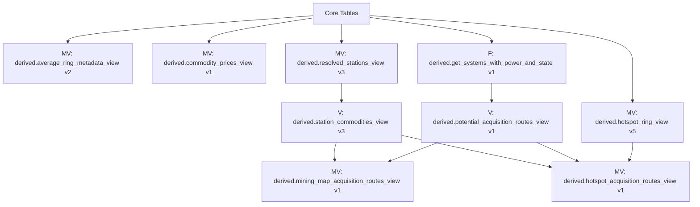

# View dependencies

```mermaid
graph TD
    CoreTables[Core Tables]
    Avg[MV: derived.average_ring_metadata_view v2]
    Prices[MV: derived.commodity_prices_view v1]
    HotspotRing[MV: derived.hotspot_ring_view v5]
    ResolvedStations[MV: derived.resolved_stations_view v3]
    StationCommodities[V: derived.station_commodities_view v3]
    GetSystems[F: derived.get_systems_with_power_and_state v1]
    PotentialRoutes[V: derived.potential_acquisition_routes_view v1]
    MiningMap[MV: derived.mining_map_acquisition_routes_view v1]
    HotspotAcq[MV: derived.hotspot_acquisition_routes_view v1]

    CoreTables --> Avg
    CoreTables --> Prices
    CoreTables --> GetSystems
    CoreTables --> HotspotRing
    CoreTables --> ResolvedStations

    ResolvedStations --> StationCommodities

    StationCommodities --> MiningMap
    StationCommodities --> HotspotAcq

    GetSystems --> PotentialRoutes

    PotentialRoutes --> MiningMap
    PotentialRoutes --> HotspotAcq

    HotspotRing --> HotspotAcq
```